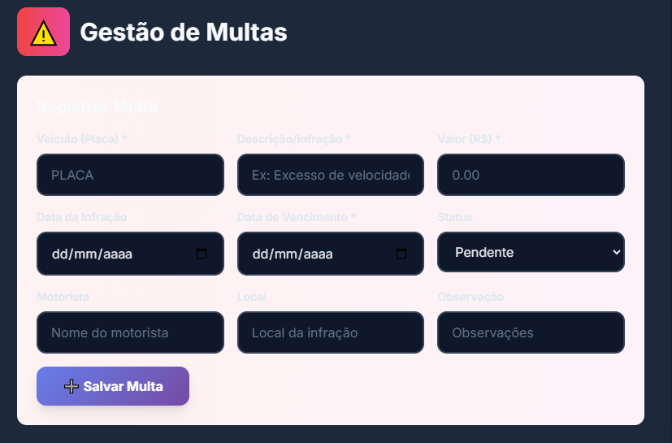

# 🚀 Guia Rápido: Usando o Sistema de Revisões

## Como Acessar

1. Faça login no sistema
2. No dashboard, clique em **"Revisões"** na sidebar esquerda (ícone de engrenagem)
3. O sistema carregará automaticamente com 13 chamados de exemplo

## 🎯 Funcionalidades Principais

### 1. Visualizar Chamados por Status

**Abas disponíveis:**
- 🔴 **Pendente** - Chamados aguardando atendimento
- 🟡 **Andamento** - Chamados em processo
- 🟢 **Resolvido** - Chamados concluídos

**Como usar:**
- Clique em qualquer aba para filtrar por status
- Os números entre parênteses mostram a quantidade de chamados

### 2. Filtrar por Categoria

**Categorias disponíveis:**
- 🔴 **Pneus** - Problemas relacionados a pneus
- 📋 **Revisão** - Manutenções preventivas
- ⚙️ **Mecânica** - Problemas mecânicos
- 🚗 **Lataria** - Danos externos

**Como usar:**
- Clique nos botões de categoria acima da lista
- Clique em "Todos" para remover o filtro

### 3. Buscar Chamados

**Campo de busca** (canto superior direito):
- Digite placa do veículo (ex: STN1C53)
- Digite nome do motorista (ex: Vinicius)
- Digite parte do título (ex: pneu furado)

**Busca em tempo real** - resultados aparecem conforme você digita

### 4. Ver Detalhes de um Chamado

**Como abrir:**
- Clique em qualquer card de chamado
- O card se expandirá mostrando:
  - Dados do motorista (nome, telefone)
  - Solicitante
  - Localização do veículo
  - Descrição completa do problema
  - Botões de ação

**Como fechar:**
- Clique novamente no card

### 5. Criar Novo Chamado

**Passos:**
1. Clique no botão **"+ Novo Chamado"** (canto superior direito)
2. Preencha o formulário:
   - **Placa** * (obrigatório) - Ex: ABC1D23
   - **Quilometragem** * (obrigatório) - Ex: 50.000
   - **Motorista** - Nome do motorista
   - **Telefone** - Contato do motorista
   - **Categoria** - Selecione: Pneus, Revisão, Mecânica ou Lataria
   - **Data** - Data do registro
   - **Título** - Resumo do problema
   - **Descrição** - Detalhes completos
   - **Status Atual** - Ex: "Aguardando Direcionamento"
   - **Localização** - Onde o veículo está
3. Clique em **"Salvar Chamado"**

### 6. Editar Chamado

**Passos:**
1. Clique no chamado para expandir detalhes
2. Clique no botão **"✏️ Editar"**
3. Modifique os campos necessários
4. Clique em **"Salvar Chamado"**

### 7. Alterar Status do Chamado

**Opções por status:**

**Se estiver PENDENTE:**
- Botão **"Mover p/ Andamento"** - Marca como em andamento

**Se estiver ANDAMENTO:**
- Botão **"◀️ Voltar"** - Retorna para pendente
- Botão **"✅ Concluir"** - Marca como resolvido

**Se estiver RESOLVIDO:**
- Botão **"🔄 Reabrir"** - Retorna para andamento

### 8. Excluir Chamado

**Passos:**
1. Clique no chamado para expandir
2. Clique no botão **"🗑️"** (ícone de lixeira)
3. Confirme a exclusão

**⚠️ ATENÇÃO:** Esta ação não pode ser desfeita!

## 📱 Minimizar Sidebar

**Para ganhar mais espaço na tela:**
1. Role até o final da sidebar (menu lateral)
2. Clique no botão com ícone de setas duplas ◀◀
3. A sidebar será minimizada, mostrando apenas os ícones
4. Clique novamente para expandir

**O estado é salvo automaticamente** - ao recarregar a página, a sidebar permanece como você deixou.

## 💾 Armazenamento

- **Todos os dados são salvos localmente** no navegador (LocalStorage)
- **Os dados persistem** mesmo após fechar o navegador
- **Cada navegador tem seus próprios dados** (não sincroniza entre dispositivos)
- **Limpar cookies/cache** pode apagar os dados

## 📊 Entendendo os Cards

Cada card mostra:
- 🚗 **Placa** - Em fonte monospace (mais fácil de ler)
- 🏷️ **Badge colorido** - Categoria do chamado
- 📊 **Quilometragem** - KM atual do veículo
- 📝 **Título** - Resumo do problema
- 📍 **Status** - Situação atual (ex: "Aguardando")

**Cores das bordas:**
- 🔴 Vermelha = Pendente
- 🟡 Amarela = Andamento
- 🟢 Verde = Resolvido

## 🎨 Dicas de Uso

### Para melhor organização:

1. **Use títulos claros** - Ex: "Pneu furado sem estepe" em vez de "Problema no pneu"

2. **Preencha a localização** - Facilita encontrar o veículo

3. **Atualize o status** - Mantenha os chamados no status correto

4. **Use descrições detalhadas** - Ajuda na resolução do problema

5. **Filtre por categoria** - Facilita encontrar tipos específicos de problemas

### Para relatórios:

1. Use a aba **"Resolvido"** para ver histórico
2. Busque por placa para ver todos os chamados de um veículo
3. Filtre por categoria para análises específicas (ex: quantos problemas de pneus)

## ❓ Problemas Comuns

### "Não vejo meus chamados"
- Verifique se está na aba correta (Pendente/Andamento/Resolvido)
- Verifique se não há filtro de categoria ativo
- Limpe a busca (campo deve estar vazio)

### "Modal não fecha"
- Clique no X no canto superior direito
- Ou clique no botão "Cancelar"
- Ou pressione ESC (em alguns navegadores)

### "Dados desapareceram"
- Pode ter sido limpeza de cache/cookies
- Verifique se está usando o mesmo navegador
- Verifique se não está em modo anônimo/privado

### "Sidebar não minimiza"
- Verifique se está em tela desktop (mobile tem comportamento diferente)
- Tente recarregar a página
- Limpe o cache do navegador

## 🔄 Fluxo Recomendado

```
1. Recebe problema no veículo
   ↓
2. Cria novo chamado (Pendente)
   ↓
3. Direciona para oficina (move para Andamento)
   ↓
4. Aguarda resolução (mantém em Andamento)
   ↓
5. Problema resolvido (move para Resolvido)
```

## 📞 Suporte

Para dúvidas ou problemas técnicos:
- Entre em contato com o administrador do sistema
- Consulte a documentação técnica (REVISOES_INTEGRACAO.md)

---

**Sistema**: Frota Sanemar  
**Versão**: 1.0  
**Última atualização**: Janeiro 2025
